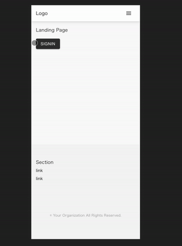

**This is a template for a react app that uses Firebase, Typescript, Redux, React Router and Styled Component**

## Setup

- `yarn install`
- `yarn start` if you want to confirm if you can run the app so far
- Setup Firebase Project for web app. Basically follow this instruction! ([https://firebase.google.com/docs/web/setup](https://firebase.google.com/docs/web/setup))
    - Access to Firebase Console ([https://console.firebase.google.com/](https://console.firebase.google.com/))
    - In the firebase console, click Add project, then select or enter a Project name
    - In the top of the firebase console, click the Web icon (</>) to launch the setup workflow
    - In the settings page of your project, copy your firebase config and overwrite the config in  `/src/utils/firebase.ts` file
    - In the firebase console, click `Database` tab and create firestore ([https://firebase.google.com/docs/firestore/quickstart](https://firebase.google.com/docs/firestore/quickstart?hl=ja))
    - In the firebase console, click `Authentication` tab and enable email and password login ([https://firebase.google.com/docs/auth](https://firebase.google.com/docs/auth?hl=ja))
    - Rewrite `reactemplate-ts` with your project's name in `.firebaserc` file. you can see it in the settings page.
    - We already have a `Function` that adds a record to the `Users` table in `Firestore` when a user is created in `Firebase Authentication`. So just deploy it.
        - `cd functions` and `yarn install`
        - `firebase deploy --only functions:createUserRecordHook`
- Uncommentout the code to setup the firebase user in `/src/App.tsx` file
- That's it! You already have `Authentication` and `Database` setup!
- Please remove image files for screenshot in README
  - `rm default-screen.gif desktop.png logout.png`

## Default Screen

### Desktop

### When you login

## Available Scripts

In the project directory, you can run:

### `yarn start`

Runs the app in the development mode. 
Open [http://localhost:3000](http://localhost:3000) to view it in the browser.

The page will reload if you make edits. 
You will also see any lint errors in the console.

### `yarn test`

Launches the test runner in the interactive watch mode. 
See the section about [running tests](https://facebook.github.io/create-react-app/docs/running-tests) for more information.

### `yarn build`

Builds the app for production to the `build` folder. 
It correctly bundles React in production mode and optimizes the build for the best performance.

The build is minified and the filenames include the hashes. 
Your app is ready to be deployed!

See the section about [deployment](https://facebook.github.io/create-react-app/docs/deployment) for more information.

### `yarn eject`

**Note: this is a one-way operation. Once you `eject`, you can’t go back!**

If you aren’t satisfied with the build tool and configuration choices, you can `eject` at any time. This command will remove the single build dependency from your project.

Instead, it will copy all the configuration files and the transitive dependencies (webpack, Babel, ESLint, etc) right into your project so you have full control over them. All of the commands except `eject` will still work, but they will point to the copied scripts so you can tweak them. At this point you’re on your own.

You don’t have to ever use `eject`. The curated feature set is suitable for small and middle deployments, and you shouldn’t feel obligated to use this feature. However we understand that this tool wouldn’t be useful if you couldn’t customize it when you are ready for it.

## Learn More

You can learn more in the [Create React App documentation](https://facebook.github.io/create-react-app/docs/getting-started).

To learn React, check out the [React documentation](https://reactjs.org/).

## Follow Me on Twitter!
[https://twitter.com/hellokenta_ja](https://twitter.com/hellokenta_ja)
